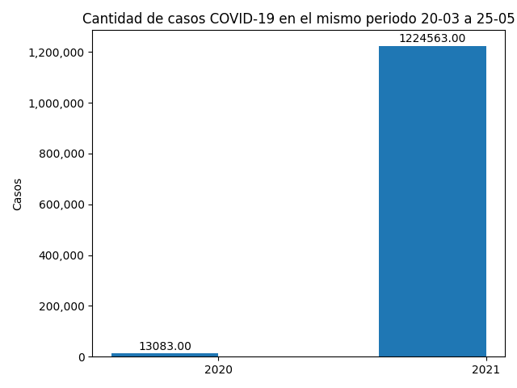
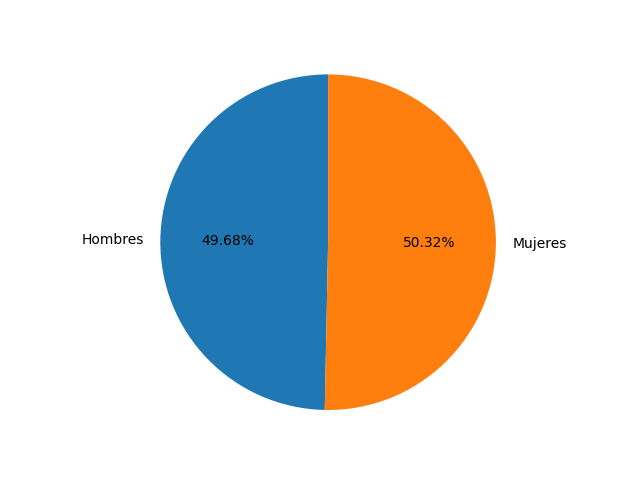
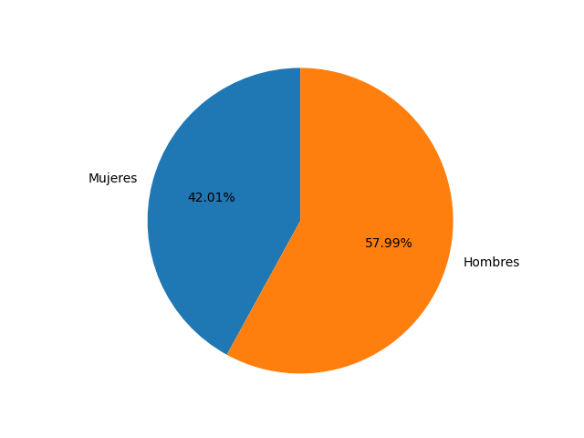
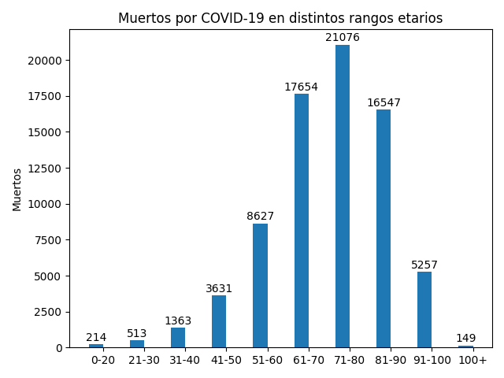

# PROYECTO PERSONAL | Visualización de datos COVID-19 en Argentina. 

## Objetivo del proyecto: 
- El objetivo del proyecto fue afianzar conocimientos adquiridos mediante cursos que tomé sobre Ingeniería de Datos, Análisis de Datos y Visualización de Datos. Para ello decidí utilizar un [Dataset](https://datos.gob.ar/dataset/salud-covid-19-casos-registrados-republica-argentina) oficial del Gobierno Nacional Argentino, el cual contiene, **hasta el día 25 de Mayo de 2021**, la cantidad de testeos realizados desde el comienzo de la pandemia, por lo tanto, el archivo contiene aproximadamente 10 millones de filas.

## Dificultades
- La principal dificultad que tuve que afrontar en este proyecto fue la manipulación de cantidades masivas de datos. No solo se debe utilizar la herramienta correcta si no también la técnica correcta, para que el procesamiento de datos no sea lento y ademas los resultados en cuanto a extracción de información sea precisa.

## Tecnologías utilizadas
- Python:
1. Pandas
2. Matplotlib
3. NumPy
- SQL:
1. Consultas SQL
2. SQLite

## Procedimientos en el proyecto
- Para comenzar cree una base de datos SQLite y con consultas SQL del tipo `DELETE FROM` elimine todas las columnas que sabía que no iba a utilizar.
- Luego con consultas SQL respondí las siguientes preguntas:
1. Cantidad de casos en el mismo periodo de tiempo (20 de Marzo a 25 de Mayo) en distintos años (2020 y 2021)
2. Porcentaje de positividad en hombres y en mujeres.
3. Porcentaje de mortalidad en hombres y en mujeres.
4. Cantidad de muertos en distintos rangos etarios.
- Después de obtener las respuestas de esas preguntas comencé a trabajar con un script de Python en el cual elimine definitivamente todas las columnas del archivo .csv que sabía que no iba a utilizar y elimine todas las filas donde `clasificacion_resumen` era *Descartado*, *Sospechoso* o *Sin clasificar*, dejando así solamente las filas donde `clasificacion_resumen` era igual a *Confirmado*, es decir, de 10 millones de filas pase a tener 3.5M(aproximadamente) de filas, que son los casos de COVID positivo que tuvo Argentina desde el comienzo de la pandemia.
- Con este archivo .csv limpio comencé a trabajar con scripts para poder esta vez obtener las respuestas a las preguntas (mediante Python) y poder crear gráficos con Matplotlib.

## Resultados de los scripts
- *Cantidad de casos en el mismo periodo de tiempo:*

Lo que podemos observar en el gráfico es que la segunda ola de COVID que sucede en Otoño de 2021 es muchísimo más fuerte y contagiosa que la primer ola. Un dato estremecedor es que en el periodo 20-03 a 25-05 de 2021 se generaron el **34,14% del TOTAL de los casos desde el inicio de la pandemia** (1.224.563 de casos de los 3.586.886).

#

- *Porcentaje de casos positivos en hombres vs cantidad de casos positivos en mujeres*

La observación es sencilla y no requiere un análisis profundo, el porcentaje de positivad en hombres y en mujeres es muy similar.

#

- *Porcentaje de mortalidad en hombres y en mujeres*

La conclusión del grafico es que si bien los hombres se contagian menos que las mujeres, los hombres mueren más que las mujeres cuando contraen COVID-19.

#

- *Cantidad de muertos en distintos rangos etarios*

Como se puede observar en el gráfico, el rango de edad más afectado por el virus en cuanto a mortalidad fue el rango de 71 a 80 años, mientras que el menos afectado fue 100 años o más (por una cuestión de que no hay mucha gente de esa edad) y el rango de 0 a 20 años, el cual tiene una mortalidad muy baja. También podemos observar que, a mayor edad, mayor riesgo, especialmente entre los 61 y 90 años.

#

## Conclusión del proyecto

Considero que este proyecto me ayudó mucho, no solo por poder afianzar y repasar conocimientos técnicos de lenguajes de programación, si no también porque trabajar con datos reales crea un enfoque más profesional y me ayuda a crecer en este campo de la informática.
